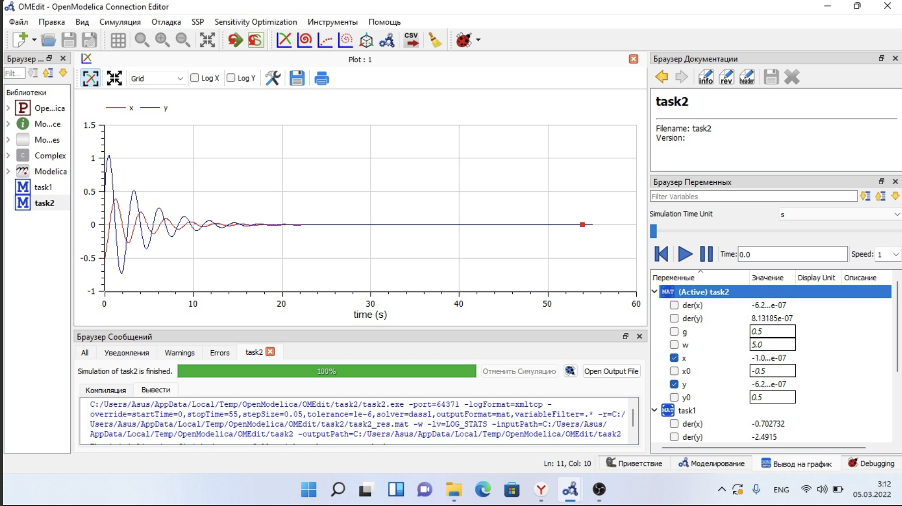
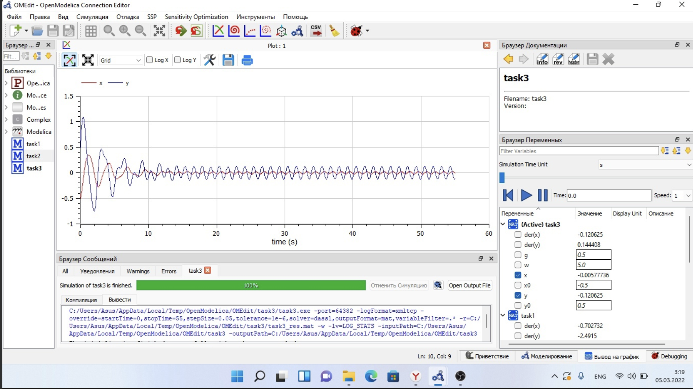

---
## Front matter
lang: ru-RU
title: Лабораторная работа №4
subtitle: Модель гармонических колебаний.
author: Stephanie Lechien
institute: RUDN University, Moscow, Russian Federation
date: 5 March, 2022, Moscow, Russian Federation

## Formatting
toc: false
slide_level: 2
theme: metropolis
header-includes: 
 - \metroset{progressbar=frametitle,sectionpage=progressbar,numbering=fraction}
 - '\makeatletter'
 - '\beamer@ignorenonframefalse'
 - '\makeatother'
aspectratio: 43
section-titles: true
---
# Цель выполнения лабораторной работы

Приобрести практические навыки при работе с моделью гармонических колебаний.

# Задание лабораторной работы

Постройте фазовый портрет гармонического осциллятора и решение уравнения
гармонического осциллятора для следующих случаев 

1. Колебания гармонического осциллятора без затуханий и без действий внешней силы
$\ddot{x}+5.5x=0$

2. Колебания гармонического осциллятора c затуханием и без действий внешней силы
$\ddot{x}+0.5\dot{x}+5x=0$

3. Колебания гармонического осциллятора c затуханием и под действием внешней силы
$\ddot{x}+5\dot{x}+0.5x=0.5cos(5t)$

На интервале $t \in [0; 55]$ (шаг 0.05) с начальными условиями 

$x_0 = -0.5, y_0 = 0.5$

# Результаты выполнения лабораторной работы

{ #fig:001 width=100% }

# Результаты выполнения лабораторной работы

{ #fig:001 width=100% }

# Результаты выполнения лабораторной работы

{ #fig:001 width=100% }

# Итоги выполнения лабораторной работы

- изучена модель гармонических колебаний;
- получены навыки работы с openmodelica;
- построено 3 графика