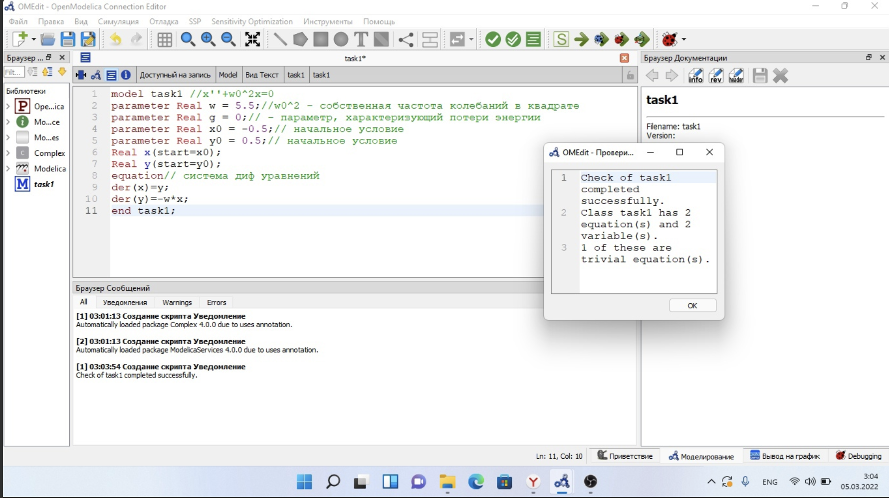
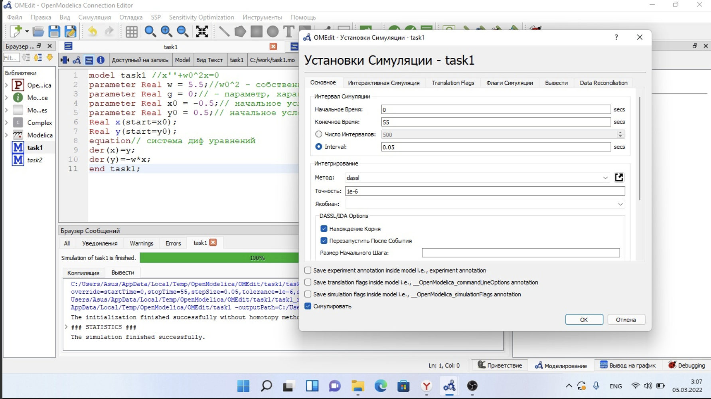
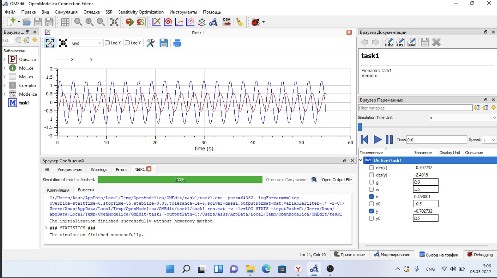
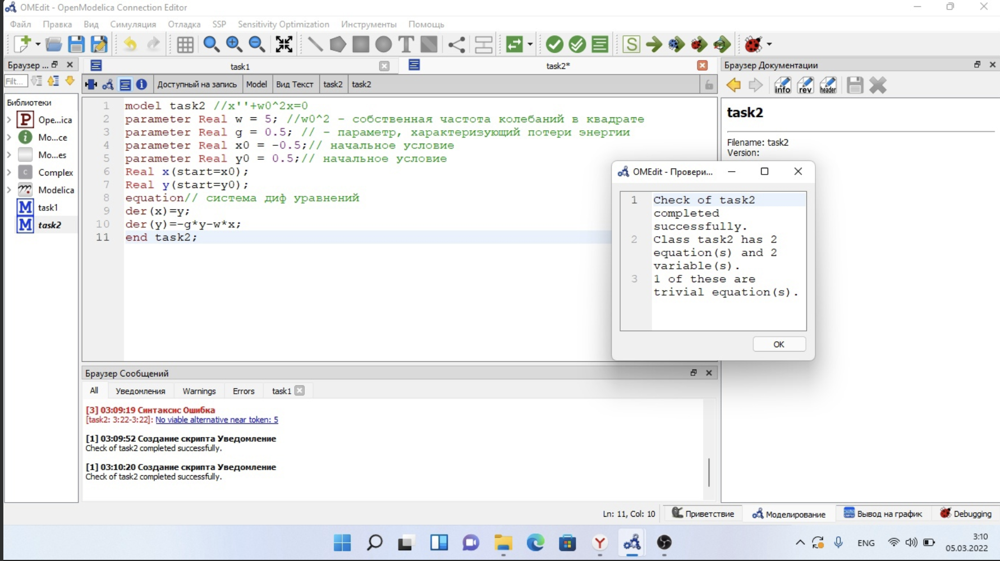
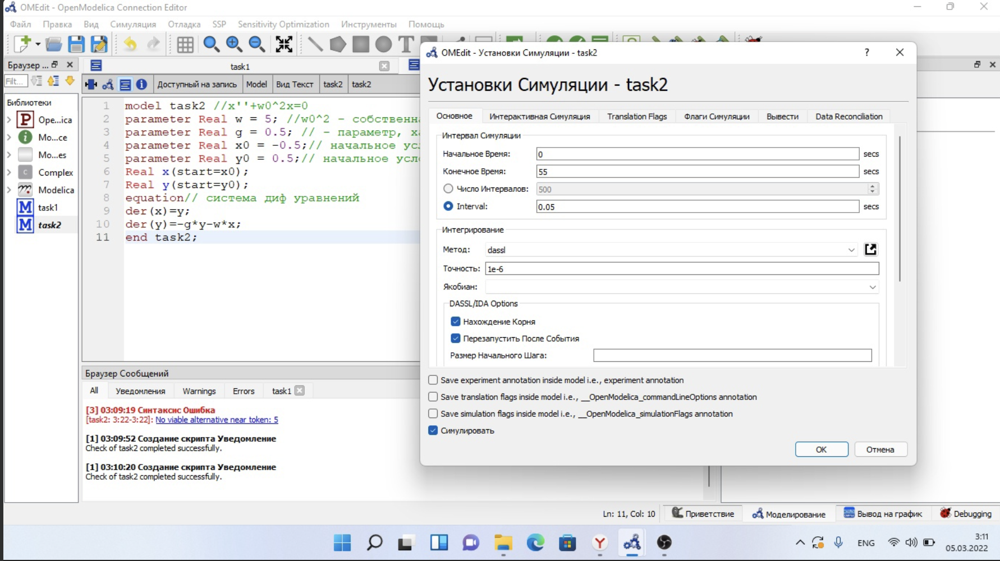
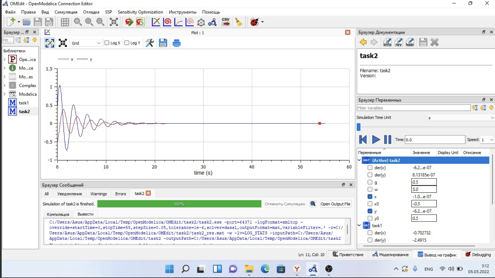
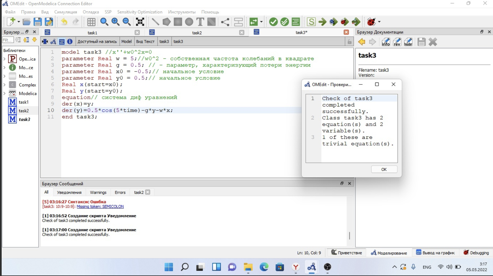
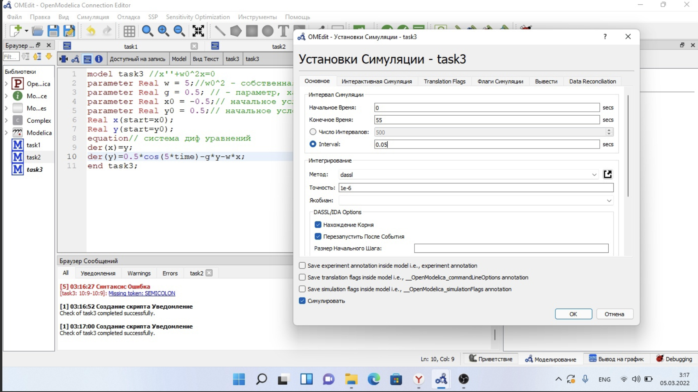

---
# Front matter
title: "Отчёт по лабораторной работе №4"
subtitle: "Модель гармонических колебаний"
author: "Стефани Лёшьен"

# Generic otions
lang: ru-RU
toc-title: "Содержание"

# Bibliography
bibliography: bib/cite.bib
csl: pandoc/csl/gost-r-7-0-5-2008-numeric.csl

# Pdf output format
toc: true # Table of contents
toc_depth: 2
lof: true # List of figures
lot: true # List of tables
fontsize: 12pt
linestretch: 1.5
papersize: a4
documentclass: scrreprt
## I18n
polyglossia-lang:
  name: russian
  options:
	- spelling=modern
	- babelshorthands=true
polyglossia-otherlangs:
  name: english
  name: el
### Fonts
mainfont: PT Serif
romanfont: PT Serif
sansfont: PT Sans
monofont: PT Mono
mainfontoptions: Ligatures=TeX
romanfontoptions: Ligatures=TeX
sansfontoptions: Ligatures=TeX,Scale=MatchLowercase
monofontoptions: Scale=MatchLowercase,Scale=0.9
## Biblatex
biblatex: true
biblio-style: "gost-numeric"
biblatexoptions:
  - parentracker=true
  - backend=biber
  - hyperref=auto
  - language=auto
  - autolang=other*
  - citestyle=gost-numeric
## Misc options
indent: true
header-includes:
  - \linepenalty=10 # the penalty added to the badness of each line within a paragraph (no associated penalty node) Increasing the value makes tex try to have fewer lines in the paragraph.
  - \interlinepenalty=0 # value of the penalty (node) added after each line of a paragraph.
  - \hyphenpenalty=50 # the penalty for line breaking at an automatically inserted hyphen
  - \exhyphenpenalty=50 # the penalty for line breaking at an explicit hyphen
  - \binoppenalty=700 # the penalty for breaking a line at a binary operator
  - \relpenalty=500 # the penalty for breaking a line at a relation
  - \clubpenalty=150 # extra penalty for breaking after first line of a paragraph
  - \widowpenalty=150 # extra penalty for breaking before last line of a paragraph
  - \displaywidowpenalty=50 # extra penalty for breaking before last line before a display math
  - \brokenpenalty=100 # extra penalty for page breaking after a hyphenated line
  - \predisplaypenalty=10000 # penalty for breaking before a display
  - \postdisplaypenalty=0 # penalty for breaking after a display
  - \floatingpenalty = 20000 # penalty for splitting an insertion (can only be split footnote in standard LaTeX)
  - \raggedbottom # or \flushbottom
  - \usepackage{float} # keep figures where there are in the text
  - \floatplacement{figure}{H} # keep figures where there are in the text

---

# Цель работы

Приобрести практические навыки при работе с моделью гармонических колебаний.

# Задание

## Вариант 68

Постройте фазовый портрет гармонического осциллятора и решение уравнения
гармонического осциллятора для следующих случаев 

1. Колебания гармонического осциллятора без затуханий и без действий внешней силы
$\ddot{x}+5.5x=0$

2. Колебания гармонического осциллятора c затуханием и без действий внешней силы
$\ddot{x}+0.5\dot{x}+5x=0$

3. Колебания гармонического осциллятора c затуханием и под действием внешней силы
$\ddot{x}+5\dot{x}+0.5x=0.5cos(5t)$

На интервале $t \in [0; 55]$ (шаг 0.05) с начальными условиями 

$x_0 = -0.5, y_0 = 0.5$

# Теоретические сведения

Уравнение свободных колебаний гармонического осциллятора имеет
следующий вид:

$\ddot{x}+2\gamma\mathrm{ }\dot{x}+x\omega\mathrm{ }_0^2=0$

$x$ – переменная, описывающая состояние системы (смещение грузика, заряд
конденсатора и т.д.); 

$\gamma\mathrm{ }$ – параметр, характеризующий потери энергии (трение в
механической системе, сопротивление в контуре);

$\omega\mathrm{ }_0 = 2$ – собственная частота колебаний; 

$t$ – время.

Уравнение (1) есть линейное однородное дифференциальное уравнение
второго порядка и оно является примером линейной динамической системы.
При отсутствии потерь в системе ($\gamma\mathrm{ } = 0$) вместо уравнения (1.1) получаем
уравнение консервативного осциллятора энергия колебания которого сохраняется
во времени.

$\ddot{x}+x\omega\mathrm{ }_0^2=0$ (2)

# 1. Колебания гармонического осциллятора без затуханий и без действий внешней силы

$\ddot{x}+5.5x=0$

В 1-ом задании уравнение имеет следующие параметры:

$x$ – переменная, описывающая состояние системы (смещение грузика, заряд
конденсатора и т.д.); 

$\gamma\mathrm{ } = 0$ – параметр, характеризующий потери энергии (затухание);

$\omega\mathrm{ }_0 = 5.5$ – собственная частота колебаний; 

$t\in [0; 55]$ – время.

Для этого уравнения я написала следующий программный код:

```
model task1 //x''+w0^2x=0
parameter Real w = 5.5;//w0^2 - собственная частота колебаний в квадрате 
parameter Real g = 0;// - параметр, характеризующий потери энергии
parameter Real x0 = -0.5;// начальное условие
parameter Real y0 = 0.5;// начальное условие
Real x(start=x0);
Real y(start=y0);
equation// система диф уравнений
der(x)=y;
der(y)=-w*x;
end task1;
```

Для начала я выполнила проверку кода. Все прошло успешно, ошибки не выявились.

{ #fig:001 width=70% }

Потом я смогла сделалать установку симуляции.

{ #fig:001 width=70% }

В итоге, я получила следующий график:

{ #fig:001 width=70% }

# 2. Колебания гармонического осциллятора c затуханием и без действий внешней силы

$\ddot{x}+0.5\dot{x}+5x=0$

В 2-ом задании уравнение имеет следующие параметры:

$x$ – переменная, описывающая состояние системы (смещение грузика, заряд
конденсатора и т.д.); 

$\gamma\mathrm{ } = 0.5$ – параметр, характеризующий потери энергии (затухание);

$\omega\mathrm{ }_0 = 5$ – собственная частота колебаний; 

$t\in [0; 55]$ – время.

Для этого уравнения я написала следующий программный код:

```
model task2 //x''+w0^2x=0
parameter Real w = 5;//w0^2 - собственная частота колебаний в квадрате 
parameter Real g = 0.5;// - параметр, характеризующий потери энергии
parameter Real x0 = -0.5;// начальное условие
parameter Real y0 = 0.5;// начальное условие
Real x(start=x0);
Real y(start=y0);
equation// система диф уравнений
der(x)=y;
der(y)=-g*y-w*x;
end task2;
```
Для начала я выполнила проверку кода. Все прошло успешно, ошибки не выявились.

{ #fig:001 width=70% }

Потом я смогла сделалать установку симуляции.

{ #fig:001 width=70% }

В итоге, я получила следующий график:

{ #fig:001 width=70% }

# 3. Колебания гармонического осциллятора c затуханием и под действием внешней силы

$\ddot{x}+5\dot{x}+0.5x=0.5cos(5t)$

В  3-ем задании уравнение имеет следующие параметры:

$x$ – переменная, описывающая состояние системы (смещение грузика, заряд
конденсатора и т.д.); 

$\gamma\mathrm{ } = 5$ – параметр, характеризующий потери энергии (затухание);

$\omega\mathrm{ }_0 = 0.5$ – собственная частота колебаний; 

$t\in [0; 55]$ – время.

Для этого уравнения я написала следующий программный код:

```
model task3 //x''+w0^2x=0
parameter Real w = 5;//w0^2 - собственная частота колебаний в квадрате 
parameter Real g = 0.5;// - параметр, характеризующий потери энергии
parameter Real x0 = -0.5;// начальное условие
parameter Real y0 = 0.5;// начальное условие
Real x(start=x0);
Real y(start=y0);
equation// система диф уравнений
der(x)=y;
der(y)=0.5*cos(5*time)-g*y-w*x;
end task3;
```

Я выполнила проверку кода.

{ #fig:001 width=70% }

После я делала установку стимуляции.

{ #fig:001 width=70% }

В итоге, я получила следующий график:

{ #fig:001 width=70% }

# Выводы

Я приобрела практические навыки при работе с моделью гармонических колебани.

# Библиография{.unnumbered}

1. Википедия https://ru.wikipedia.org/wiki/Гармонические_колебания


::: {#refs}
:::


